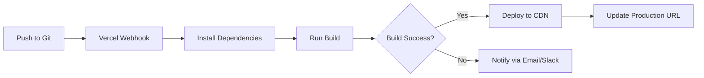

<Info>
  **Prerequisites**:
  - A [Vercel account](https://vercel.com/signup) (free tier available)
  - Project repository on GitHub, GitLab, or Bitbucket
  - Node.js 19+ for local builds
</Info>

Vercel provides zero-configuration deployment for Vite applications with automatic builds, preview deployments, and global CDN distribution. The Pirson Dev Portfolio is optimized for Vercel deployment.

## Vercel Configuration

The project includes a `vercel.json` configuration file that handles client-side routing:

```json vercel.json
{
  "rewrites": [
    { "source": "/(.*)", "destination": "/" }
  ]
}
```

<Note>
This rewrite rule ensures all routes are handled by React Router, enabling client-side navigation for paths like `/projects` or `/about` without 404 errors.
</Note>

## Deploy to Vercel

<Steps>
<Step title="Connect your repository">

1. Go to [vercel.com](https://vercel.com) and sign in
2. Click **Add New Project**
3. Import your Git repository (GitHub, GitLab, or Bitbucket)
4. Select the repository containing your portfolio

<Note>
Grant Vercel access to your repository when prompted. You can limit access to specific repositories for security.
</Note>

</Step>

<Step title="Configure project settings">

Vercel automatically detects Vite projects. Verify these settings:

- **Framework Preset**: Vite
- **Build Command**: `npm run build` (or `vite build`)
- **Output Directory**: `dist`
- **Install Command**: `npm install`
- **Node.js Version**: 20.x (recommended)

<Warning>
Do not modify the output directory unless you've changed it in `vite.config.js`. The default `dist/` directory is correct.
</Warning>

</Step>

<Step title="Deploy">

Click **Deploy** to start your first deployment.

Vercel will:
1. Clone your repository
2. Install dependencies with `npm install`
3. Run `npm run build` to create production bundle
4. Deploy to Vercel's global CDN
5. Assign a production URL (e.g., `https://your-project.vercel.app`)

Deployment typically completes in 1-2 minutes.

</Step>

<Step title="Verify deployment">

Once deployed, Vercel provides:
- **Production URL**: Your live site (e.g., `pirsondev.vercel.app`)
- **Deployment logs**: Full build output for debugging
- **Analytics**: Traffic and performance metrics

Test your deployment:
- ✓ All pages load correctly
- ✓ Navigation works (React Router)
- ✓ Language switching functions (EN, ES, FR)
- ✓ Theme toggle works (light/dark mode)
- ✓ Vercel Analytics tracks pageviews

</Step>
</Steps>

## Automatic Deployments

Vercel automatically deploys your site when you push to Git:

### Production Deployments
Pushing to your **main** or **master** branch triggers a production deployment:

```bash
git add .
git commit -m "Update portfolio content"
git push origin main
```

Vercel will:
1. Detect the push via webhook
2. Start a new build automatically
3. Deploy to your production URL
4. Update DNS records instantly

<Note>
Production deployments typically complete in 1-2 minutes. Your site will show the new version once deployment finishes.
</Note>

### Preview Deployments
Pushing to **any other branch** or opening a **pull request** creates a preview deployment:

```bash
git checkout -b feature/new-design
git push origin feature/new-design
```

Vercel generates a unique preview URL like `https://your-project-git-feature-new-design.vercel.app`.

**Benefits of preview deployments:**
- Test changes before merging to main
- Share work-in-progress with others
- Each commit gets its own URL
- No impact on production site

## Environment Variables

If your portfolio uses environment variables, configure them in Vercel:

<Steps>
<Step title="Open project settings">

Go to your Vercel project dashboard and click **Settings** → **Environment Variables**.

</Step>

<Step title="Add variables">

For each environment variable:

1. Enter the **Key** (e.g., `VITE_API_URL`)
2. Enter the **Value** (e.g., `https://api.example.com`)
3. Select environments: **Production**, **Preview**, **Development**
4. Click **Save**

<Warning>
Vite environment variables must start with `VITE_` to be exposed to your application. Variables without this prefix are not accessible in client-side code.
</Warning>

</Step>

<Step title="Redeploy">

Environment variable changes require a redeployment:

1. Go to **Deployments** tab
2. Click the three dots on the latest deployment
3. Select **Redeploy**

Or push a new commit to trigger automatic redeployment.

</Step>
</Steps>

### Accessing Environment Variables

In your Vite application, access variables via `import.meta.env`:

```javascript
const apiUrl = import.meta.env.VITE_API_URL
const mode = import.meta.env.MODE // 'production' or 'development'
```

## Custom Domains

Add a custom domain to your Vercel project:

<Steps>
<Step title="Navigate to domains">

In your Vercel project, go to **Settings** → **Domains**.

</Step>

<Step title="Add domain">

1. Enter your domain (e.g., `pirsondev.com`)
2. Click **Add**
3. Vercel will show DNS configuration instructions

</Step>

<Step title="Configure DNS">

At your domain registrar (GoDaddy, Namecheap, Cloudflare, etc.), add:

**For apex domain** (`pirsondev.com`):
- Type: `A`
- Name: `@`
- Value: `76.76.21.21`

**For www subdomain** (`www.pirsondev.com`):
- Type: `CNAME`
- Name: `www`
- Value: `cname.vercel-dns.com`

</Step>

<Step title="Wait for verification">

DNS propagation takes 24-48 hours (usually faster). Vercel automatically:
- Issues SSL certificate (via Let's Encrypt)
- Configures HTTPS redirect
- Sets up www → apex redirect

</Step>
</Steps>

<Note>
Vercel provides free SSL certificates for all domains with automatic renewal.
</Note>

## Vercel Analytics

The portfolio includes Vercel Analytics via `@vercel/analytics`:

```javascript src/main.jsx
import { Analytics } from '@vercel/analytics/react'

function App() {
  return (
    <>
      {/* Your app */}
      <Analytics />
    </>
  )
}
```

This enables:
- **Real-time pageviews**: See traffic as it happens
- **Top pages**: Understand which pages are most popular
- **Referrer tracking**: Know where visitors come from
- **Device breakdown**: Desktop vs mobile traffic

<Note>
Analytics are available in your Vercel project dashboard under the **Analytics** tab. The free tier includes 100k events per month.
</Note>

## Performance Optimization

Vercel automatically provides several performance optimizations:

### Global CDN
Your site is distributed across 100+ edge locations worldwide, ensuring fast load times regardless of visitor location.

### Automatic Compression
Vercel applies Brotli and Gzip compression to all assets, reducing transfer sizes by up to 90%.

### Image Optimization
While this portfolio doesn't use Next.js Image, you can optimize images by:
- Using WebP format for photos
- Compressing images before committing
- Using SVG for icons and logos

### Cache Headers
Vercel automatically sets optimal cache headers:
- Static assets (`/assets/*`): cached for 1 year
- HTML (`index.html`): no cache (always fresh)

## Deployment Monitoring

Monitor your deployments in the Vercel dashboard:

### Build Logs
View complete build output for each deployment:
1. Go to **Deployments**
2. Click on any deployment
3. View **Building** and **Function Logs** tabs

### Deployment Status
Each deployment shows:
- ✓ **Ready**: Successfully deployed and live
- ⏳ **Building**: Currently building
- ✗ **Error**: Build failed (check logs)
- **Canceled**: Manually canceled

### Build Time
Typical build times for this portfolio:
- **Cold build**: 60-90 seconds (first build or after dependency changes)
- **Warm build**: 30-45 seconds (subsequent builds)

## Troubleshooting

<AccordionGroup>
  <Accordion title="Build fails with 'command not found: npm'">
    Vercel couldn't find npm to install dependencies.
    
    **Solution:**
    1. Check Node.js version in project settings (should be 20.x)
    2. Verify `package.json` exists in repository root
    3. Ensure build command is set to `npm run build`
  </Accordion>

  <Accordion title="Site loads but routing returns 404">
    The `vercel.json` rewrite rule isn't working.
    
    **Solution:**
    1. Verify `vercel.json` exists in repository root
    2. Check that the rewrite rule matches: `{ "source": "/(.*)", "destination": "/" }`
    3. Redeploy after adding/fixing `vercel.json`
  </Accordion>

  <Accordion title="Environment variables not working">
    Variables may not be prefixed correctly or not exposed to client.
    
    **Solution:**
    1. Ensure all client-side variables start with `VITE_`
    2. Verify variables are added in Vercel dashboard
    3. Select correct environments (Production, Preview, Development)
    4. Redeploy after adding variables
  </Accordion>

  <Accordion title="Deploy succeeds but site shows old version">
    Browser caching may be showing a stale version.
    
    **Solution:**
    1. Hard refresh: `Ctrl+Shift+R` (Windows/Linux) or `Cmd+Shift+R` (Mac)
    2. Check deployment URL shows as "Current" in Vercel dashboard
    3. Verify correct Git branch is deployed
    4. Clear browser cache and cookies
  </Accordion>
</AccordionGroup>

## CI/CD Integration

Vercel's automatic Git integration provides complete CI/CD:



## Next Steps

<CardGroup cols={2}>

<Card title="Build Process" icon="hammer" href="/deployment/build">
  Learn about the Vite build process and optimization.
</Card>

<Card title="Development" icon="code" href="/getting-started/development">
  Set up local development environment.
</Card>

</CardGroup>

<Note>
**Need help?** Visit [Vercel Documentation](https://vercel.com/docs) or check your deployment logs in the Vercel dashboard.
</Note>